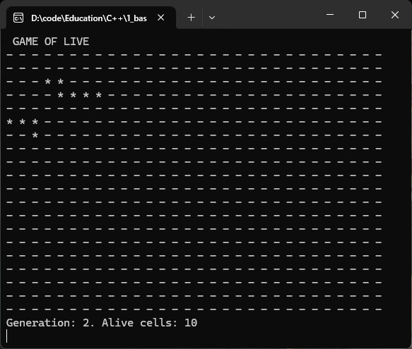
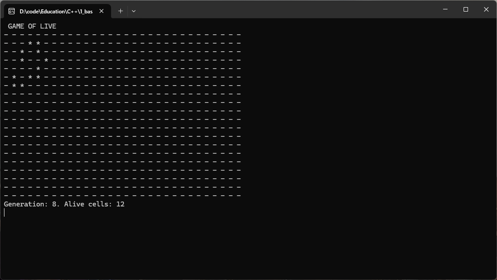
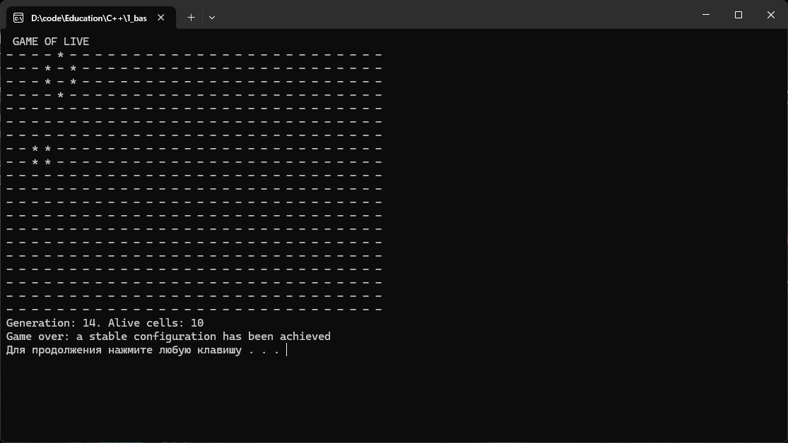

# Курсовой проект «Игра "Жизнь"»

Курсовой проект по программированию на C++.  
Реализация классической игры «Жизнь» Джона Конвея с отображением в консоли, пошаговым пересчётом поколений и загрузкой начальной конфигурации из текстового файла.

## Содержание

- [Курсовой проект «Игра "Жизнь"»](#курсовой-проект-игра-жизнь)
  - [Содержание](#содержание)
  - [Заданий](#заданий)
  - [Правила игры](#правила-игры)
  - [Требования к системе](#требования-к-системе)
  - [Сборка и запуск](#сборка-и-запуск)
  - [Формат входного файла](#формат-входного-файла)
  - [Пример работы](#пример-работы)
  - [Структура кода](#структура-кода)
  - [Примечания](#примечания)

---

## [Заданий](./task/README.md)

## Правила игры

Игровое поле — прямоугольная сетка (Вселенная) размером `rows × cols`. Каждая клетка может быть **живой** (`*`) или **мёртвой** (`-`).  
Смена поколений происходит одновременно по следующим правилам:

1. Живая клетка **выживает**, если у неё ровно **2 или 3** живых соседа; иначе погибает.
2. Мёртвая клетка **оживает**, если рядом ровно **3** живых соседа.

Игра завершается, если:
- все клетки становятся мёртвыми (`alive == 0`);
- два соседних поколения полностью совпадают (достигнута стабильная конфигурация).

---

## Требования к системе

- Операционная система **Windows** (используются `windows.h`, `_sleep()` и `std::system("cls")`).
- Компилятор с поддержкой C++11 и выше (например, **Visual Studio 2022** или **MinGW**).
- Текстовый редактор (VS Code, Visual Studio и т.п.).

---

## Сборка и запуск

1. Склонируйте или скачайте проект.
2. Убедитесь, что файл `initStatus.txt` лежит в той же директории, что и исполняемый файл (или укажите свой путь в коде).
3. Скомпилируйте `main.cpp` (например, в VS Code с помощью задач или вручную):

   ```bash
   g++ main.cpp -o game_of_life.exe
   ```
   Программа автоматически загрузит начальное состояние из initStatus.txt, отобразит первое поколение и будет обновлять экран с задержкой 1 секунда до выполнения условия остановки.

## Формат входного файла
Файл `initStatus.txt` имеет следующую структуру:

- **Первая строка** — два целых числа: количество строк и количество столбцов.

- **Далее** — произвольное количество пар чисел, где каждая пара задаёт координаты **(строка, столбец)** живой клетки.

**Пример** (из задания):

```text
20 30
2 3
2 4
3 4
3 5
3 6
3 7
5 0
5 1
5 2
6 2
```

## Пример работы
При запуске на консоль выводится текущее состояние поля, номер поколения и число живых клеток.

Начальное состояние из примера выше:



Состояние в процессе вычислений:



Конечное состояние:



После каждого шага экран очищается и выводится новое поколение.
Наглядные примеры эволюции можно увидеть в папке `images` (если вы добавите скриншоты из задания).

## Структура кода
Программа состоит из нескольких ключевых функций:

| Функция | Назначение |
|---------|------------|
| `createUniverse` | Выделяет память под двумерный массив `bool` (поле) и инициализирует все клетки как `false` (мёртвые). |
| `loadFile` | Считывает из файла координаты живых клеток и устанавливает соответствующие элементы в `true`. |
| `countAliveNearby` | Подсчитывает количество живых соседей для клетки с заданными координатами, учитывая границы поля. |
| `updateNextUniverse` | Строит следующее поколение на основе текущего, применяя правила игры. Возвращает `true`, если состояние изменилось (для проверки стабильности). |
| `copyUniverse` | Копирует содержимое одного поля в другое (используется для перехода к следующему поколению). |
| `countAliveUniverse` | Подсчитывает общее число живых клеток на поле. |
| `printField` | Выводит поле в консоль с форматированием (символы разделены пробелами), номер поколения и количество живых клеток. |
| `destroyUniverse` | Освобождает динамическую память, выделенную под поле. |

Основной цикл в `main()`:
1. Открывает файл, считывает размеры.
2. Создаёт два поля: текущее и следующее.
3. В бесконечном цикле:
   - выводит текущее поколение;
   - проверяет, не закончилась ли игра (нет живых клеток);
   - вычисляет следующее поколение;
   - если изменения не произошло — завершает игру;
   - копирует следующее поколение в текущее;
   - делает паузу 1 секунду.

## Примечания
- Задержка между поколениями задаётся константой `DELAY = 1000` (миллисекунд) и реализована через `_sleep()` (Windows).
- Очистка консоли выполняется с помощью `std::system("cls")`. Для Linux/Unix потребуется заменить на `"clear"` (и использовать `sleep()` из `<unistd.h>`).
- Программа не обрабатывает ошибки ввода-вывода файла, кроме случая, если файл не открыт (выводится сообщение и выход).
- При желании можно доработать код для поддержки аргументов командной строки (путь к файлу, настройка задержки и т.д.).