# Курсовой проект: «Симулятор гонок»

**Курсовой проект** — простейшая реализация симулятора гонок для фэнтезийных транспортных средств (ТС).

## Содержание

- [Курсовой проект: «Симулятор гонок»](#курсовой-проект-симулятор-гонок)
  - [Содержание](#содержание)
  - [Ссылка на задание](#ссылка-на-задание)
  - [Описание проекта](#описание-проекта)
    - [Основные возможности](#основные-возможности)
    - [Реализованы дополнительные возможности](#реализованы-дополнительные-возможности)
  - [Технологии](#технологии)
  - [Пример работы](#пример-работы)

---

## [Ссылка на задание](./task/README.md)

---

## Описание проекта

Консольное приложение, моделирующее гонки различных типов транспортных средств (наземных и воздушных). Проект реализован на **C++** с использованием **объектно-ориентированного подхода**, **динамической библиотеки (DLL)** и **CMake** для сборки.

### Основные возможности

- Выбор типа гонки:
  - только наземный транспорт,
  - только воздушный транспорт,
  - смешанный (оба типа).
- Задание дистанции.
- Регистрация транспортных средств из предложенного списка.
- Удаление зарегистрированных участников.
- Запуск гонки и расчёт времени прохождения с учётом индивидуальных характеристик:
  - для наземных транспортных средств – скорость и время на отдых,
  - для воздушных транспортных средств – скорость и коэффициент ускорения (сокращения дистанции).
- Вывод результатов (место, имя, время) и возможность повторного запуска.

---

### Реализованы дополнительные возможности

- **Удаление зарегистрированных транспортных средств** – пользователь может исключить любое транспортное средство из списка участников до начала гонки. В оригинальном задании эта функция не предусмотрена, но она повышает удобство интерфейса и демонстрирует навыки работы с динамическими структурами данных.

## Технологии

- **C++11/17** – объектно-ориентированное программирование, полиморфизм, умные указатели.
- **CMake 3.10+** – кросс-платформенная система сборки.
- **Динамическая библиотека (DLL)** – вся игровая логика вынесена в отдельную библиотеку.
- **Консольный интерфейс** – ввод/вывод через стандартные потоки, поддержка кириллицы (**Windows-1251**).

---

## Пример работы

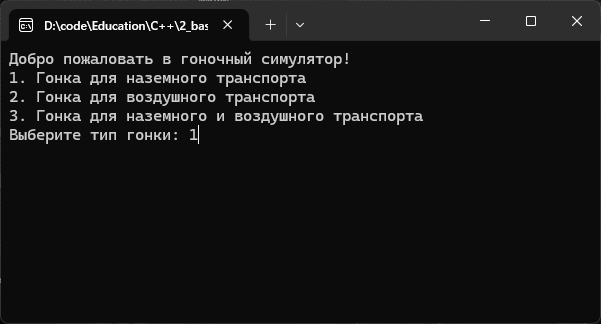

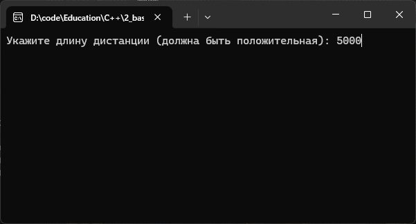

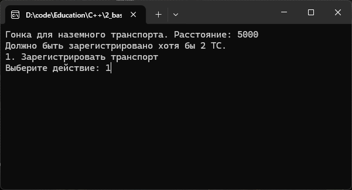

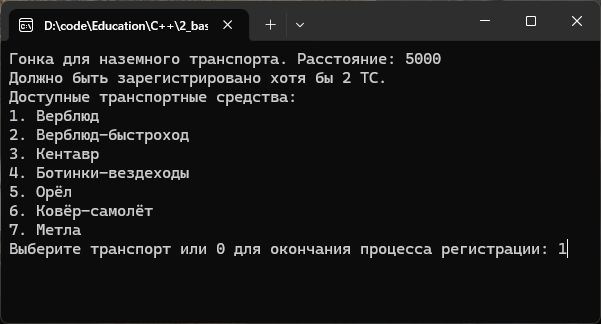

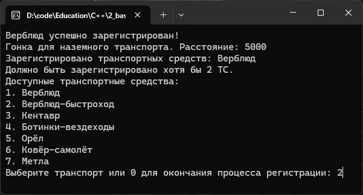

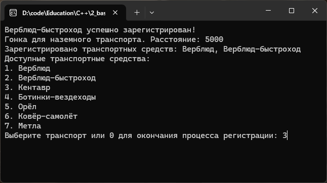

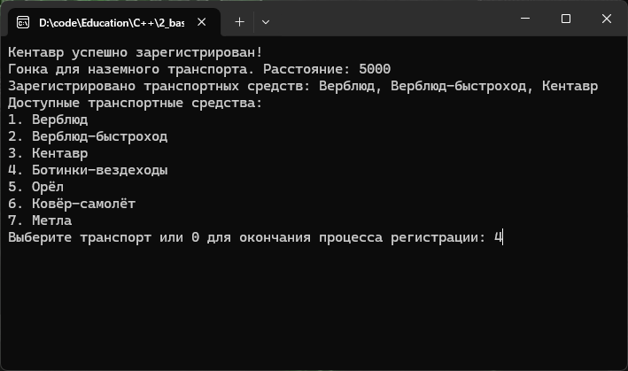

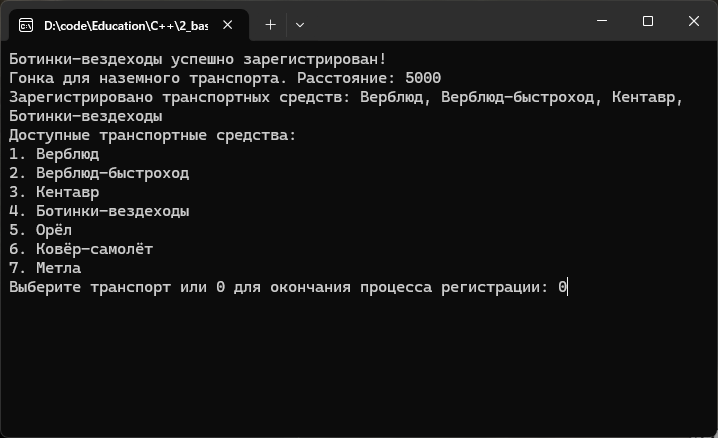

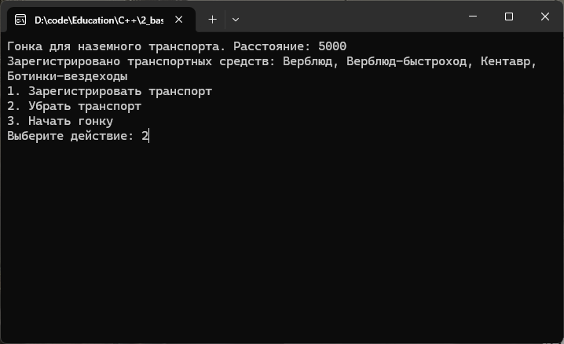

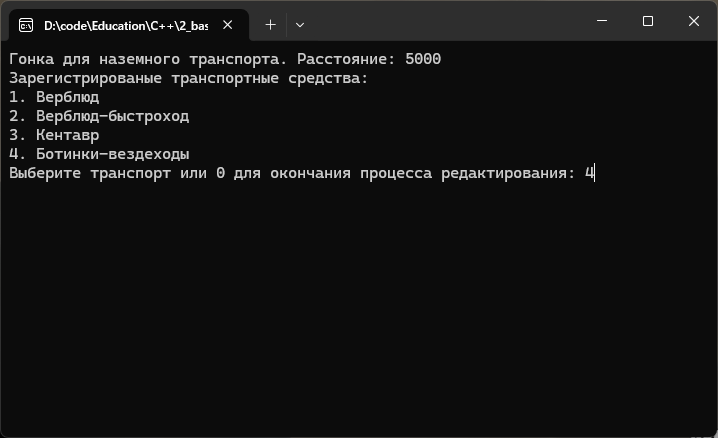

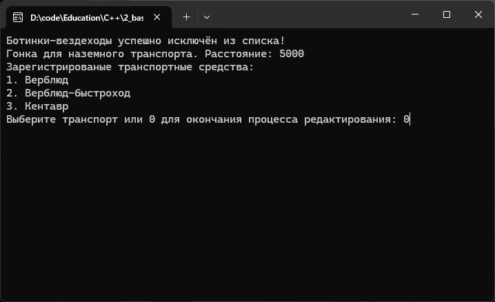

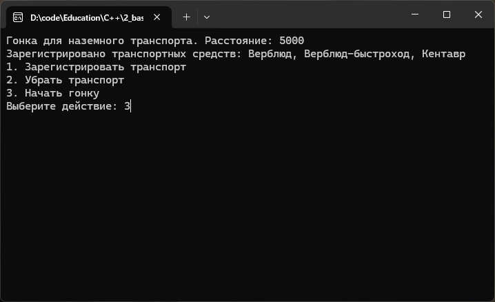

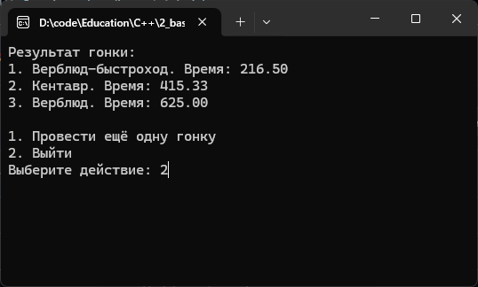

---